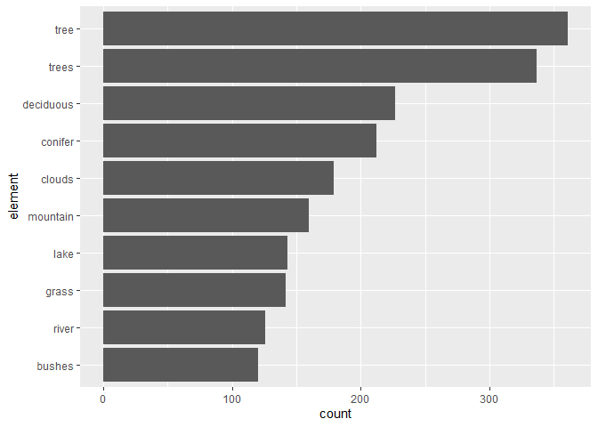
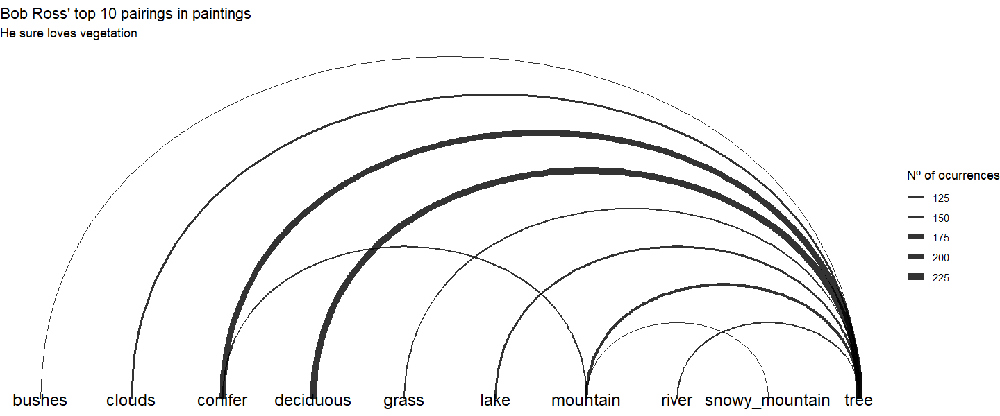

Tidy Tuesday 06/08/2019
================

# Data description

Each of the columns after episode/title correspond to the binary
presence (0 or 1) of that element in the painting.

# Import data and packages

``` r
#bob_ross <- readr::read_csv("https://raw.githubusercontent.com/rfordatascience/tidytuesday/master/data/2019/2019-08-06/bob-ross.csv")
#write_csv(bob_ross, "boss_ross.csv")
bob_ross <- readr::read_csv("boss_ross.csv")


library(tidyverse)
library(visNetwork)
library(igraph)
library(tidygraph)
library(ggraph)
library(Cairo)
```

# Data

``` r
#recommended step to clean episode information and frame elements
#I'll only work with the paintings

bob_ross <- bob_ross %>% 
  janitor::clean_names() %>% 
  separate(episode, into = c("season", "episode"), sep = "E") %>% 
  mutate(season = str_extract(season, "[:digit:]+")) %>% 
  mutate_at(vars(season, episode), as.integer) %>% 
  select(-c(contains("frame"), title))

dim(bob_ross)
```

    ## [1] 403  53

Very wide dataframe. Let’s change it to a long, tidy format.

``` r
bob_ross <- bob_ross %>% 
  gather("element", "presence", -c(season, episode))
```

This get us a lot of lines with zeroes, let’s dispose of them.

``` r
bob_ross <- bob_ross %>% 
  filter(presence >0)
```

# EDA

Now a little exploratory analysis.

``` r
bob_ross %>% 
  count(element) %>% 
  top_n(10, n) %>% 
  ggplot(aes(x = reorder(factor(element), n), 
             y = n)) +
    geom_col() +
    labs(x = "element", y ="count") +
  coord_flip()
```

<!-- -->

So tree, and trees, are the most common elements. The top 10 elements in
general are related with nature, landscapes and backgrounds.

Let’s take a closer look to tree and trees.

``` r
bob_ross %>% 
  group_by(season, episode) %>% 
  summarise(
    only_tree = ifelse(any(element == "tree") & !(any(element == "trees")), 1, 0),
    only_trees = ifelse(!any(element == "tree") & (any(element == "trees")), 1, 0),
    both_tree_trees = ifelse(any(element == "tree") & (any(element == "trees")), 1, 0)
  ) %>% 
  ungroup() %>% 
  select(-c(season, episode)) %>% 
  summarise_all(sum)
```

<div class="kable-table">

| only\_tree | only\_trees | both\_tree\_trees |
| ---------: | ----------: | ----------------: |
|         24 |           0 |               337 |

</div>

So trees is not very informative, since it only says if more than one
tree is in the picture and not a really new element. Let’s take away
this element and refer to tree as “at least one tree”. And let’s do the
same for mountains.

``` r
bob_ross <- bob_ross %>% 
  filter(element != "trees", element != "mountains")
```

# Network graph

## Preparing the nodes

First we create a data frame of nodes, with individual ids for each
element name (label).

``` r
nodes <- bob_ross %>% 
  group_by(season, episode) %>% 
  mutate(count_el = sum(presence)) %>% 
  dplyr::filter(count_el > 1) %>%
  ungroup() %>% 
  select(label = element) %>% 
  distinct() %>% 
  rowid_to_column("id")
```

So we have 48 unique nodes for our network graph, which is all elements
with the exception of *lakes*, which isn’t present in any painting,
*trees*, *mountains* and frame elements.

Now preparing the edges. Probably there’s a better way to do this but
this large set of steps is what I could come up with. It involves:

  - Creating a table with the element counts;
  - Join it with itself to create the connections;
  - Eliminate the elements’ connections to themselves created by the
    join.
  - Eliminate the mirrored connections. Since join repeats rows that are
    only a partial match, all combinations are considered and we end up
    with every connection twice.
  - Label the connections with the correct ids.

<!-- end list -->

``` r
#Creates a variable of element counts
edges_i <- bob_ross %>% 
  group_by(season, episode) %>% 
  mutate(count_el = sum(presence)) %>%
  dplyr::filter(count_el > 1) %>% #just to make sure there isn't any element without a connection 
  ungroup() %>% 
  select(-c(presence,count_el))

#Creates a table of top 100 connections and their sizes
edges_l <- edges_i %>% 
  inner_join(edges_i, by = c("season", "episode")) %>% 
  dplyr::filter(element.x != element.y) %>% 
  group_by(grp = paste(pmax(element.x, element.y), pmin(element.x, element.y), sep = "_"), season, episode) %>%
  slice(1) %>%
  ungroup() %>% 
  select(-c(grp, season, episode)) %>%
  group_by(element.x, element.y) %>% 
  summarise(value = n()) %>% 
  ungroup() %>% 
  top_n(100, value)

#Label the connections correctly
edges <- edges_l %>% 
  left_join(nodes, by = c("element.x" = "label")) %>% 
  rename(from = id) %>% 
  left_join(nodes, by = c("element.y" = "label")) %>% 
  rename(to = id) %>% 
  select(from, to, value)
```

Then we’ll look into the nodes again to only select the nodes that
appear in the top 100 connections, so we don’t have any isolated node in
the network.

``` r
#Get only the nodes that are in the top 100 connections
nodes_chose <- nodes %>% 
  dplyr::filter(id %in% c(edges$from, edges$to))

#Variable for size of the nodes
nodes_chose$size <- bob_ross %>% 
  dplyr::filter(presence == 1) %>% 
  count(element) %>% 
  inner_join(nodes_chose, by = c("element" = "label")) %>% 
  .$n/10
```

## Create the interactive network

With visNetwork package it’s easy to create a network element. But we
have to try it some times to choose a good seed and solver algorithm and
parameters. I didn’t discover how to make annotations, so I tried to
give the minimum relevant information in title and subtitle. And fade
them a little so they don’t take attention away from the data.

``` r
#create visualization
#Html content. Not run in the md.
visNetwork(nodes_chose, edges,
           main = list( text = "What elements does Bob Ross paint together?",
                        style = 'font-family:Georgia, Times New Roman, Times, serif;
                        font-weight:bold;font-size:20px;text-align:left;color:slategray;'
                        ),
           submain = list(text = 'Close circles have similar pairings, large circles are common elements, thick lines are common pairings' ,
                          style ='font-family:Georgia, Times New Roman, Times, serif;
                          font-size:13px;text-align:left;color:slategray'
                          )
           )%>%
  visNodes(color = list(background = "steelblue",
                        border = "lightblue",
                        highlight = "orange"),
           font = list(size = 16)
           ) %>%
  visEdges(color = list(color = "lightblue", highlight = "steelblue")
           ) %>%
  visPhysics(solver = "forceAtlas2Based",
             forceAtlas2Based = list(gravitationalConstant = -22)
             )%>%
  visLayout(randomSeed = 100) %>%
  visInteraction(navigationButtons = TRUE)
```

<!--html_preserve-->

<div id="htmlwidget-cf278b6c9df049f101f7" class="visNetwork html-widget" style="width:910px;height:650px;">

</div>

<script type="application/json" data-for="htmlwidget-cf278b6c9df049f101f7">{"x":{"nodes":{"id":[3,7,8,10,12,13,14,15,23,26,30,32,34,37,38,39,40,42,43,44,45,46,48],"label":["beach","bushes","cabin","cirrus","clouds","conifer","cumulus","deciduous","grass","lake","mountain","ocean","path","river","rocks","snow","snowy_mountain","structure","sun","tree","waterfall","waves","winter"],"size":[2.7,12,6.9,2.8,17.9,21.2,8.6,22.7,14.2,14.3,16,3.6,4.9,12.6,7.7,7.5,10.9,8.5,4,36.1,3.9,3.4,6.9]},"edges":{"from":[3,3,3,7,7,7,7,7,7,7,7,7,7,8,8,8,8,8,8,8,8,10,12,12,12,12,12,12,12,12,12,12,12,12,12,12,12,13,13,13,13,13,13,13,13,13,13,13,13,14,14,14,14,14,14,15,15,15,15,15,15,15,15,15,15,15,15,23,23,23,23,23,23,26,26,26,26,26,30,30,30,30,30,32,34,37,37,37,37,38,39,39,39,39,40,42,42,43,44,44],"to":[12,32,46,12,13,14,15,23,26,30,37,40,44,12,13,15,26,39,42,44,48,12,13,14,15,23,26,30,32,37,38,39,40,42,44,46,48,14,15,23,26,30,37,38,39,40,42,44,48,15,23,26,30,40,44,23,26,30,34,37,38,39,40,42,43,44,48,26,30,37,38,40,44,30,39,40,42,44,37,39,40,44,48,46,44,38,40,44,45,44,40,42,44,48,44,44,48,44,45,48],"value":[25,27,26,54,75,32,72,43,55,63,45,46,120,30,50,44,25,28,60,69,29,27,100,83,84,57,62,86,32,51,43,32,59,35,147,30,28,47,82,68,92,129,68,34,56,94,50,212,53,45,30,37,46,33,74,98,83,67,38,83,37,40,41,59,25,227,36,44,60,61,28,35,136,81,25,58,29,142,49,29,109,156,29,34,45,37,33,126,34,60,25,33,75,67,108,84,33,32,39,69]},"nodesToDataframe":true,"edgesToDataframe":true,"options":{"width":"100%","height":"100%","nodes":{"shape":"dot","color":{"background":"steelblue","border":"lightblue","highlight":"orange"},"font":{"size":16}},"manipulation":{"enabled":false},"edges":{"color":{"color":"lightblue","highlight":"steelblue"}},"physics":{"solver":"forceAtlas2Based","forceAtlas2Based":{"gravitationalConstant":-22}},"layout":{"randomSeed":100},"interaction":{"navigationButtons":true}},"groups":null,"width":null,"height":null,"idselection":{"enabled":false},"byselection":{"enabled":false},"main":{"text":"What elements does Bob Ross paint together?","style":"font-family:Georgia, Times New Roman, Times, serif;\n                        font-weight:bold;font-size:20px;text-align:left;color:slategray;"},"submain":{"text":"Close circles have similar pairings, large circles are common elements, thick lines are common pairings","style":"font-family:Georgia, Times New Roman, Times, serif;\n                          font-size:13px;text-align:left;color:slategray"},"footer":null,"background":"rgba(0, 0, 0, 0)","tooltipStay":300,"tooltipStyle":"position: fixed;visibility:hidden;padding: 5px;white-space: nowrap;font-family: verdana;font-size:14px;font-color:#000000;background-color: #f5f4ed;-moz-border-radius: 3px;-webkit-border-radius: 3px;border-radius: 3px;border: 1px solid #808074;box-shadow: 3px 3px 10px rgba(0, 0, 0, 0.2);"},"evals":[],"jsHooks":[]}</script>

<!--/html_preserve-->

## Creating a still network

I also created a still network using ggraph package, but the image
didn’t render nicely using windows.

``` r
edges <- edges %>% 
  top_n(10, value) 


nodes_chose <- nodes %>% 
  dplyr::filter(id %in% c(edges$from, edges$to))

nodes_chose$size <- bob_ross %>% 
  count(element) %>% 
  inner_join(nodes_chose, by = c("element" = "label")) %>% 
  .$n/10

br_igraph <- graph_from_data_frame(d = edges[,1:3], vertices = nodes_chose[,1:2], directed = TRUE)

br_tidy <- as_tbl_graph(br_igraph)

windowsFonts("Arial Narrow" = windowsFont("Arial"))

p <- ggraph(br_tidy, layout = "linear") + 
  geom_edge_arc(aes(width = value), alpha = 0.8) + 
  scale_edge_width(range = c(0.2, 3)) +
  geom_node_text(aes(label = label), size = 5) +
  labs(title = "Bob Ross' top 10 pairings in paintings",
       subtitle = "He sure loves vegetation",
    edge_width = "Nº of ocurrences") +
  theme_void()
```

``` r
p
```

<!-- -->
