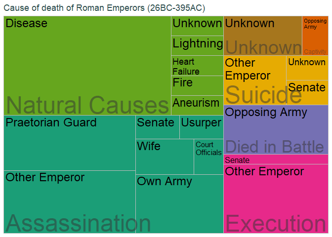

Roman Emperors 13/08/2019
================

# Data description

Information about Roman emperors such as their birth date and place,
reign start and end, death cause and others.

# Import data and packages

``` r
# emperors <- readr::read_csv("https://raw.githubusercontent.com/rfordatascience/tidytuesday/master/data/2019/2019-08-13/emperors.csv")
# readr::write_csv(emperors, "emperors.csv")
emperors <- readr::read_csv("emperors.csv")

library(tidyverse)
library(treemapify)
```

# Data

Since it’s a small dataset, I’ll look it with Rstudio Viewer.

``` r
#View(emperors)
head(emperors)
```

<div class="kable-table">

| index | name     | name\_full                                   | birth      | death      | birth\_cty | birth\_prv         | rise         | reign\_start | reign\_end | cause         | killer        | dynasty        | era        | notes                                                                                               | verif\_who             |
| ----: | :------- | :------------------------------------------- | :--------- | :--------- | :--------- | :----------------- | :----------- | :----------- | :--------- | :------------ | :------------ | :------------- | :--------- | :-------------------------------------------------------------------------------------------------- | :--------------------- |
|     1 | Augustus | IMPERATOR CAESAR DIVI FILIVS AVGVSTVS        | 0062-09-23 | 0014-08-19 | Rome       | Italia             | Birthright   | 0026-01-16   | 0014-08-19 | Assassination | Wife          | Julio-Claudian | Principate | birth, reign.start are BCE. Assign negative for correct ISO 8601 dates. Cause may have been Natural | Reddit user zonination |
|     2 | Tiberius | TIBERIVS CAESAR DIVI AVGVSTI FILIVS AVGVSTVS | 0041-11-16 | 0037-03-16 | Rome       | Italia             | Birthright   | 0014-09-18   | 0037-03-16 | Assassination | Other Emperor | Julio-Claudian | Principate | birth is BCE. Assign negative for correct ISO 8601 dates. Possibly assassinated by praetorian guard | Reddit user zonination |
|     3 | Caligula | GAIVS IVLIVS CAESAR AVGVSTVS GERMANICVS      | 0012-08-31 | 0041-01-24 | Antitum    | Italia             | Birthright   | 0037-03-18   | 0041-01-24 | Assassination | Senate        | Julio-Claudian | Principate | assassination may have only involved the Praetorian Guard                                           | Reddit user zonination |
|     4 | Claudius | TIBERIVS CLAVDIVS CAESAR AVGVSTVS GERMANICVS | 0009-08-01 | 0054-10-13 | Lugdunum   | Gallia Lugdunensis | Birthright   | 0041-01-25   | 0054-10-13 | Assassination | Wife          | Julio-Claudian | Principate | birth is BCE. Assign negative for correct ISO 8601 dates.                                           | Reddit user zonination |
|     5 | Nero     | NERO CLAVDIVS CAESAR AVGVSTVS GERMANICVS     | 0037-12-15 | 0068-06-09 | Antitum    | Italia             | Birthright   | 0054-10-13   | 0068-06-09 | Suicide       | Senate        | Julio-Claudian | Principate | NA                                                                                                  | Reddit user zonination |
|     6 | Galba    | SERVIVS SVLPICIVS GALBA CAESAR AVGVSTVS      | 0002-12-24 | 0069-01-15 | Terracina  | Italia             | Seized Power | 0068-06-08   | 0069-01-15 | Assassination | Other Emperor | Flavian        | Principate | birth is BCE. Assign negative for correct ISO 8601 dates.                                           | Reddit user zonination |

</div>

Most of the data is date or categorical. I’m curious about how many
different death causes and killers we have.

``` r
emperors_ck <- emperors %>% 
  transmute(cause = factor(cause),
         killer = factor(killer))

summary(emperors_ck)
```

    ##             cause                 killer  
    ##  Assassination :25   Other Emperor   :18  
    ##  Captivity     : 1   Disease         :16  
    ##  Died in Battle: 5   Praetorian Guard: 7  
    ##  Execution     : 8   Opposing Army   : 6  
    ##  Natural Causes:21   Own Army        : 5  
    ##  Suicide       : 5   Unknown         : 5  
    ##  Unknown       : 3   (Other)         :11

So we have just 7 death causes and some varied killer motives.

``` r
emperors_ck <- emperors_ck %>% 
  transmute(parent = cause,
            id = killer) %>% 
  group_by(parent, id) %>% 
  summarise(value = n())
```

``` r
ggplot(emperors_ck, aes(area = value, fill = parent, label = id, subgroup = parent))+
  geom_treemap() +
  geom_treemap_text(place = 'topleft', min.size = 8, reflow = T) +
  geom_treemap_subgroup_text(
    alpha = 0.5, place = 'bottomleft'
  ) +
  scale_fill_brewer(palette = 'Dark2') +
  theme(
    legend.position = 'none',
    title = element_text(colour = 'darkslategrey')
  ) +
  labs(title = 'Cause of death of Roman Emperors (26BC-395AC)')
```

<!-- -->
